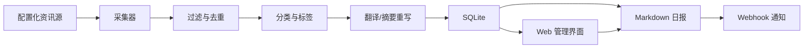

# 架构说明

## 模块

- `osdaily.collectors`：RSS、社区源、Mastodon、YouTube、Twitter/X 官方 API 采集。
- `osdaily.processing`：URL 规范化、关键词过滤、黑名单过滤、标题相似合并、分类。
- `osdaily.enrichment`：OpenAI 翻译和摘要重写，带 SQLite 缓存。
- `osdaily.storage`：SQLite 存储、编辑、导出选中条目。
- SQLite 条目包含 `curation_status` 和 `editor_note`，用于沉淀运营采纳反馈。
- `osdaily.report`：Markdown 日报渲染。
- `osdaily.runner`：端到端采集流水线，CLI 和 Web 管理界面共用。
- `osdaily.admin`：本地 Web 管理界面和 API。
- `osdaily.notify`：Webhook payload 适配。
- `osdaily.validation`：配置完整性检查。
- `osdaily.quality`：多日运行摘要聚合与质量报告。
- `osdaily.scheduler`：管理服务内置每日定时调度。
- `osdaily.readiness`：交付就绪检查。

## 数据流

## 可靠性策略

- 单个源失败不会中断整次运行。
- HTTP 5xx 自动重试。
- SQLite URL hash 去重。
- 标题相似度合并。
- 运行摘要 JSON 记录源状态、过滤数量、告警和 enrichment 统计。
- `ADMIN_TOKEN` 可保护管理界面。
- 可选择 GitHub Actions 或内置 scheduler 执行每日任务。
